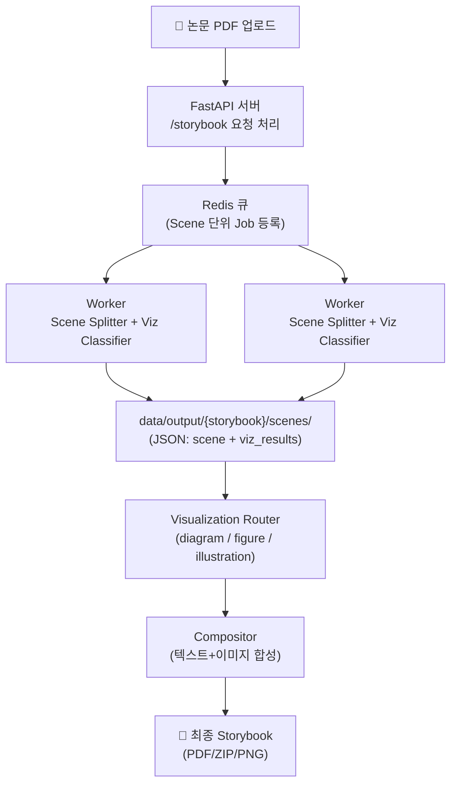

# Paper Storybook API

논문 PDF를 입력받아 **스토리라인 기반 동화책** 형태로 재가공하는 REST API 서버입니다.  
장면(Scene) 단위로 텍스트와 시각화를 합성하여, 유튜브 해설 같은 흐름을 책/슬라이드로 제공합니다.

<br>

---

## 🚀 아키텍처 개요



<br>

## 📂 폴더 구조

```yaml
project-root/
│
├─ 📂data/                  # 입력/출력 데이터 저장소
│ ├─ raw/                    # 업로드된 원본 PDF
│ ├─ processed/{paper_id}/   # 전처리 결과물 (final_text.txt: 하나의 긴 문자열)
│ └─ output/{storybook_id}/  # 최종 산출물 (씬별 PNG, storybook.pdf, assets)
│
├─ 📂src/                    # 애플리케이션 코드
│ ├─ 📂api/                  # FastAPI 라우터(엔드포인트 정의)
│ │ ├─ papers.py              # 논문 업로드/전처리 API
│ │ ├─ storybooks.py          # 스토리북 생성/조회 API
│ │ ├─ jobs.py                # 비동기 Job 상태 확인 API
│ │ ├─ config.py              # API 설정 관련 엔드포인트
│ │ └─ auth.py                # 인증(JWT 등) 처리
│ │
│ ├─ 📂texprep/               # TeX 전처리 파이프라인
│ │ ├─ pipeline.py             # 전처리 메인 파이프라인
│ │ ├─ postprocess.py          # 후처리 (citation ID 치환, inline 수식 정리 등)
│ │ ├─ 📂io/
│ │ │ ├─ discover.py           # main.tex 추론
│ │ │ ├─ auto_merge.py         # 여러 tex 병합
│ │ │ └─ select.py             # 그래프 유틸
│ │ └─ 📂tex/
│ │    ├─ expander.py          # \input, \include 확장
│ │    └─ strip.py             # 불필요 환경 제거, 본문 추출
│ │
│ ├─ 📂services/              # 서비스 로직 계층 (비즈니스 로직)
│ │ ├─ preprocess.py          # PDF 전처리 로직 (텍스트, 수식, figure 추출)
│ │ ├─ preprocess_arxiv.py    # arXiv 전용: ID 추출, PDF/소스 다운로드, TeX 추정
│ │
│ │ ├─ 📂llm/
│ │ │ ├─ scene_splitter.py  # Scene 분리 + 내레이션 생성
│ │ │ └─ viz_classifier.py  # 시각화 JSON 분류 + 후처리
│ │
│ │ ├─ 📂visualization/
│ │ │ ├─ router.py                    # viz 타입별 라우팅(도식화/그림/원본 figure)
│ │ │ ├─ diagram.py                   # 코드 기반 도식화(Graphviz, Matplotlib 등)
│ │ │ ├─ figure.py                    # 원본 figure 강조/annotation 처리
│ │ │ └─ illustration_api.py          # 외부 이미지 생성 API 호출
│ │
│ │ ├─ 📂compositor/
│ │ │ ├─ layout_engine.py             # 프레임 레이아웃 배치
│ │ │ └─ exporter.py                  # 최종 PNG/SVG/PDF 출력
│ │
│ │ └─ storage.py                     # 파일/객체 저장소 접근 공통 모듈
│ │
│ ├─ 📂workers/
│ │ ├─ queue.py                       # RQ/Redis 큐 초기화
│ │ └─ tasks.py                       # Job(Task) 정의 (스토리북 생성 등)
│ │
│ ├─ 📂core/
│ │ ├─ models.py                      # 데이터 모델(Pydantic/ORM)
│ │ ├─ db.py                          # DB 연결/세션
│ │ ├─ config.py                      # 환경변수/설정 로딩
│ │ └─ logging.py                     # 공통 로깅 설정
│ │
│ └─ main.py                          # FastAPI 진입점 (app 초기화, 라우팅 연결)
│
├─ 📂configs/
│ └─ default.yaml                     # 기본 서버/모델 설정
│
├─ 📂docker/
│ ├─ Dockerfile.api                   # API 서버 도커파일
│ ├─ Dockerfile.worker                # Worker 도커파일
│ └─ docker-compose.yml               # 전체 서비스 실행 설정
│
└─ 📂tests/
   ├─ check_tokens         # preprocess_all 로 생성된 txt 파일의 토큰 수 확인
   ├─ preprocess_all       # pdf를 전처리된 txt 파일로 생성
   ├─ run_scene_splitter   # scene(스크립트) 생성 확인
   └─ run_viz_pipeline     # scene -> viz 파이프라인
```

<br>

---

## 🔑 주요 엔드포인트

- `POST /v1/papers` : PDF 업로드
- `POST /v1/papers/{paper_id}/preprocess` : 전처리 실행
- `POST /v1/papers/{paper_id}/storybook` : 해설책 생성 Job 등록
- `GET /v1/jobs/{job_id}` : Job 상태 확인
- `GET /v1/storybooks/{storybook_id}` : Storybook 메타 조회
- `GET /v1/storybooks/{storybook_id}/scenes` : Scene 리스트 조회
- `GET /v1/storybooks/{storybook_id}/export?format=pdf|zip|html` : 전체 내보내기

<br>

---

## ⚙️ 실행 방법

### 1) Docker Compose 실행

```bash
docker-compose up --build
```

### 2) 서버 접속

API: http://localhost:8080

Docs (Swagger UI): http://localhost:8080/docs

<br>

---

## 🔒 환경 변수 설정 (.env 예시)

루트 디렉토리에 `.env` 파일을 만들고 다음 내용을 채워주세요:

```env
# Claude API Key
ANTHROPIC_API_KEY=sk-ant-xxxxxxxxxxxxxxxx

# LLM 관련 설정
CLAUDE_DEFAULT_MODEL=claude-3-opus
CLAUDE_MAX_TOKENS=2000
```

<br>

---

## 🛠 기술 스택

- Backend: FastAPI, Pydantic
- Queue: Redis + RQ
- DB: PostgreSQL (개발용 SQLite 가능)
- Visualization: Graphviz, LaTeX
- Illustration: Stable Diffusion API
- Containerization: Docker, docker-compose

<br>

---

## 📌 진행 흐름

1. PDF 업로드 → 전처리 (하나의 긴 문자열)
2. Scene Splitter: 장면 분리 + 내레이션 생성
3. Viz Classifier: 내레이션 기반 JSON 시각화 정의

- 보정 로직 포함
  - 잘못된 tool 값 → diagram 이동
  - 중복 키(graph, dot, scene_graph) → diagram 통합
  - fallback 시 auto_fallback 다이어그램 보장

4. Visualization Router

- Diagram → Graphviz
- Illustration → 최소화, 외부 API

5. Compositor: 텍스트+이미지 합성
6. Exporter: PDF/ZIP 생성

<br>

---

## 📑 Viz Classifier 후처리 규칙

- DOT 코드가 잘못 tool에 들어온 경우 → diagram으로 이동
- graph/graphviz/dot 키 → diagram 표준화
- 중복 라벨 제거 후 최대 2개 시각화만 유지
- fallback 다이어그램 자동 생성 (항상 깨지지 않음)

<br>

---

## 📌 진행 현황 (Roadmap)

- [x] 전처리 파이프라인 완성
- [x] Scene Splitter + Viz Classifier (후처리 포함)

- [ ] **시각화/합성 모듈**

  - [ ] Diagram (Graphviz)
  - [ ] Illustration (외부 이미지 API)
  - [ ] Compositor: 텍스트+이미지 합성
  - [ ] Exporter: PDF/ZIP 내보내기

- [ ] **API 서버**

  - [ ] 파일 기반 → 메모리 기반 전환
  - [ ] FastAPI 엔드포인트 구현
  - [ ] Job Queue(RQ/Redis) 연동
  - [ ] Job 상태 조회/스토리북 다운로드 API 완성

- [ ] **배포/운영**

  - [ ] Dockerfile/Docker Compose 구성
  - [ ] 모니터링 (Prometheus/Grafana)
  - [ ] Cloud 환경 배포

---
