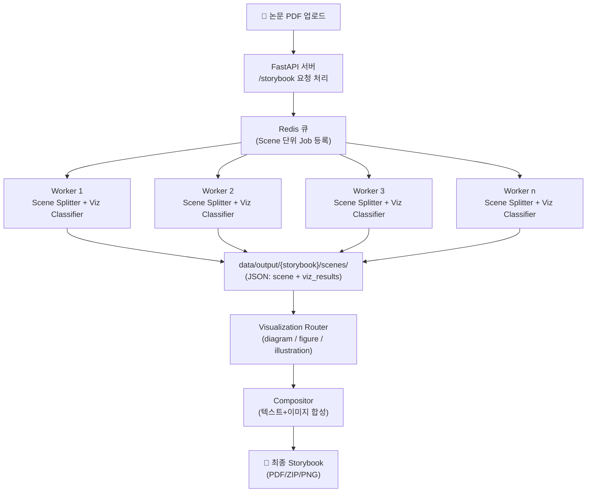

# Paper Storybook API

논문 PDF를 입력받아 **스토리라인 기반 동화책** 형태로 재가공하는 REST API 서버입니다.  
장면(Scene) 단위로 텍스트와 시각화를 합성하여, 유튜브 해설 같은 흐름을 책/슬라이드로 제공합니다.

<br>

---

## 🚀 아키텍처 개요



<br>

## 📂 폴더 구조

```yaml
project-root/
│
├─ 📂data/                  # 입력/출력 데이터 저장소
│ ├─ raw/                    # 업로드된 원본 PDF
│ ├─ processed/{paper_id}/   # 전처리 결과물 (final_text.txt: 하나의 긴 문자열)
│ └─ output/{storybook_id}/  # 최종 산출물 (씬별 PNG, storybook.pdf, assets)
│
├─ 📂src/                    # 애플리케이션 코드
│ ├─ 📂api/                  # FastAPI 라우터(엔드포인트 정의)
│ │ ├─ papers.py              # 논문 업로드/전처리 API
│ │ ├─ storybooks.py          # 스토리북 생성/조회 API
│ │ ├─ jobs.py                # 비동기 Job 상태 확인 API
│ │ ├─ config.py              # API 설정 관련 엔드포인트
│ │ └─ auth.py                # 인증(JWT 등) 처리
│ │
│ ├─ 📂texprep/               # TeX 전처리 파이프라인
│ │ ├─ pipeline.py             # 전처리 메인 파이프라인
│ │ ├─ postprocess.py          # 후처리 (citation ID 치환, inline 수식 정리 등)
│ │ ├─ 📂io/
│ │ │ ├─ discover.py           # main.tex 추론
│ │ │ ├─ auto_merge.py         # 여러 tex 병합
│ │ │ └─ select.py             # 그래프 유틸
│ │ └─ 📂tex/
│ │    ├─ expander.py          # \input, \include 확장
│ │    └─ strip.py             # 불필요 환경 제거, 본문 추출
│ │
│ ├─ 📂services/              # 서비스 로직 계층 (비즈니스 로직)
│ │ ├─ preprocess.py          # PDF 전처리 로직 (텍스트, 수식, figure 추출)
│ │ ├─ preprocess_arxiv.py    # arXiv 전용: ID 추출, PDF/소스 다운로드, TeX 추정
│ │
│ │ ├─ 📂llm/
│ │ │ ├─ scene_splitter.py            # 논문 → Scene 분리 + 한국어 내레이션 동시 생성
│ │ │ └─ viz_classifier.py            # Scene 내레이션 기반 → viz_type + viz_prompt 생성
│ │
│ │ ├─ 📂visualization/
│ │ │ ├─ router.py                    # viz 타입별 라우팅(도식화/그림/원본 figure)
│ │ │ ├─ diagram.py                   # 코드 기반 도식화(Graphviz, Matplotlib 등)
│ │ │ ├─ figure.py                    # 원본 figure 강조/annotation 처리
│ │ │ └─ illustration_api.py          # 외부 이미지 생성 API 호출
│ │
│ │ ├─ 📂compositor/
│ │ │ ├─ layout_engine.py             # 프레임 레이아웃 배치
│ │ │ └─ exporter.py                  # 최종 PNG/SVG/PDF 출력
│ │
│ │ └─ storage.py                     # 파일/객체 저장소 접근 공통 모듈
│ │
│ ├─ 📂workers/
│ │ ├─ queue.py                       # RQ/Redis 큐 초기화
│ │ └─ tasks.py                       # Job(Task) 정의 (스토리북 생성 등)
│ │
│ ├─ 📂core/
│ │ ├─ models.py                      # 데이터 모델(Pydantic/ORM)
│ │ ├─ db.py                          # DB 연결/세션
│ │ ├─ config.py                      # 환경변수/설정 로딩
│ │ └─ logging.py                     # 공통 로깅 설정
│ │
│ └─ main.py                          # FastAPI 진입점 (app 초기화, 라우팅 연결)
│
├─ 📂configs/
│ ├─ default.yaml                     # 기본 서버/모델 설정
│ └─ viz_rules.yaml                   # viz_classifier용 시각화 라우팅 규칙
│
├─ 📂docker/
│ ├─ Dockerfile.api                   # API 서버 도커파일
│ ├─ Dockerfile.worker                # Worker 도커파일
│ └─ docker-compose.yml               # 전체 서비스 실행 설정
│
└─ 📂tests/
   ├─ pipeline_runner.py               # texprep 파이프라인 실행 테스트
   ├─ scene_splitter_test.py           # Scene + Narration 생성 테스트
   ├─ viz_classifier_test.py           # Viz 타입/프롬프트 생성 테스트
   └─ ...
```

<br>

---

## 🔑 주요 엔드포인트

- `POST /v1/papers` : PDF 업로드
- `POST /v1/papers/{paper_id}/preprocess` : 전처리 실행
- `POST /v1/papers/{paper_id}/storybook` : 해설책 생성 Job 등록
- `GET /v1/jobs/{job_id}` : Job 상태 확인
- `GET /v1/storybooks/{storybook_id}` : Storybook 메타 조회
- `GET /v1/storybooks/{storybook_id}/scenes` : Scene 리스트 조회
- `GET /v1/storybooks/{storybook_id}/export?format=pdf|zip|html` : 전체 내보내기

<br>

---

## ⚙️ 실행 방법

### 1) Docker Compose 실행

```bash
docker-compose up --build
```

### 2) 서버 접속

API: http://localhost:8080

Docs (Swagger UI): http://localhost:8080/docs

---

## 테스트 실행 방법

```bash
# arXiv PDF 다운로드 (data/raw/t.pdf 생성)
python tests/arxiv_downloader.py --pdf data/raw/t.pdf

# 전처리 파이프라인 실행
python -m tests.pipeline_runner
```

실행 후 data/output/{doc_id}/ 안에:

- merged_body.tex : 병합된 LaTeX 본문
- final_text.txt : 후처리된 최종 텍스트 산출물

이렇게 2가지 결과가 생성됨.

---

## 🔒 환경 변수 설정 (.env 예시)

루트 디렉토리에 `.env` 파일을 만들고 다음 내용을 채워주세요:

```env
# Claude API Key (Anthropic)
ANTHROPIC_API_KEY=sk-ant-xxxxxxxxxxxxxxxx
```

<br>

### 📜 viz_rules.yaml 예시

```yaml
version: 1
rules:
  - when:
      llm_visualization_type_in: ["flowchart", "block_diagram", "pipeline"]
    then: diagram
  - when:
      llm_visualization_type_in: ["bar_chart", "line_chart", "table"]
    then: diagram
  - when:
      llm_visualization_type_in: ["original_figure"]
    then: figure
  - when:
      llm_visualization_type_in:
        ["conceptual_illustration", "metaphor", "abstract"]
    then: illustration
fallback: diagram
```

<br>

## 🛠 기술 스택

- Backend: FastAPI, Pydantic
- Queue: RQ + Redis (Celery 대체 가능)
- DB: PostgreSQL (또는 SQLite 개발용)
- Visualization: Graphviz, Matplotlib, LaTeX
- External Illustration: Stable Diffusion API, Remote GPU
- Containerization: Docker, docker-compose
- Monitoring: Prometheus, Grafana

<br>

## 📌 진행 흐름

1. PDF 업로드 → 전처리 (하나의 긴 문자열)
2. LLM: Scene 분리와 내레이션 텍스트 + 시각화 타입 판정
3. Router:
   - Diagram → Graphviz/Matplotlib
   - Figure → 원본 figure
   - Illustration → 외부 API 호출
4. Compositor: 텍스트 + 이미지 합성 → Scene PNG/SVG
5. Exporter: 전체 PDF/ZIP 생성
6. 클라이언트는 Job 완료 후 Storybook 다운로드

---

### 📑 전처리 결과 (예시)

- 전처리 단계는 PDF에서 본문을 추출하여 **하나의 긴 문자열**로 산출합니다.
- 이 문자열은 LaTeX 스타일 마크업(`\section`, `\begin{abstract}`, 수식 등)을 포함할 수 있습니다.
- 평균 길이는 20페이지 내외의 AI 논문 본문이며, Scene 분리 단계에서 LLM에 직접 입력됩니다.

예시 (일부):

```txt
\begin{abstract}
The dominant sequence transduction models are based on complex recurrent or convolutional...
\end{abstract}

\section{Introduction}
Recurrent neural networks, long short-term memory [CITATION] and gated recurrent...
```

---

## 📌 진행 현황 (Roadmap)

- [x] **전처리 파이프라인**

  - [x] `auto_merge`, `expander` 기반 TeX 확장/병합
  - [x] 본문 추출 및 불필요 환경/명령 제거 (`strip.py`)
  - [x] Citation ID 치환 및 inline 수식 정리 (`postprocess.py`)
  - [x] 최종 산출물(`final_text.txt`) 생성
  - [x] CLI 기반 테스트 코드 (`tests/pipeline_runner.py`) 작성

- [x] **스토리북 생성 파이프라인(1차)**

  - [x] Scene 단위 분리 (`scene_splitter`)
  - [ ] 시각화 타입 분류 (`viz_classifier`)

- [ ] **시각화/합성 모듈**

  - [ ] Diagram (Graphviz/Matplotlib)
  - [ ] Figure (원본 figure + annotation)
  - [ ] Illustration (외부 이미지 API)
  - [ ] Compositor: 텍스트+이미지 합성
  - [ ] Exporter: PDF/ZIP 내보내기

- [ ] **API 서버**

  - [ ] FastAPI 엔드포인트 구현
  - [ ] Job Queue(RQ/Redis) 연동
  - [ ] Job 상태 조회/스토리북 다운로드 API 완성

- [ ] **배포/운영**

  - [ ] Dockerfile/Docker Compose 구성
  - [ ] 모니터링 (Prometheus/Grafana)
  - [ ] Cloud 환경 배포


### ⚠️ 현재 이슈: LLM JSON 파싱 실패

- **증상**: `scene_splitter` 단계에서 LLM 응답이 JSON 배열 형식이 아닌 설명문/잡담이 섞여 들어와 `json.loads` 실패.
- **원인(추정)**: 작은 모델의 형식 일탈, 과도한 입력 길이, 출력에 불필요한 텍스트 첨가.
- **영향**: `viz_classifier`까지 연쇄 폴백 발생 → `RAW_OUTPUT` 기반 흐름도만 저장됨.

#### 임시 대응(적용됨)
- `safe_json_loads`: 응답에서 `[...]` 구간만 정규식으로 추출 후 파싱 재시도.
- 입력 트렁케이션: 본문 길이 상한 적용.
- RAW 폴백 시 로컬 규칙 기반 임시 씬 분할 → `viz_classifier`는 계속 진행.

#### 개선 계획
- 모델 상향 및 토큰 여유 확보: `CLAUDE_DEFAULT_MODEL=claude-3-5-sonnet`, `CLAUDE_MAX_TOKENS=2048`.
- 장면 수 명시(6~10개)로 출력 길이 제어.
- 2단계 파싱 루트: (1) 구간/제목 JSON → (2) 내레이션 JSON, 단계별 검증.
- 실패 로그 축적 및 프롬프트 미세조정.

#### 체크리스트
- [ ] `.env`에 모델/토큰 상향 반영
- [ ] scene_splitter 2단계 분리 옵션 추가
- [ ] 파싱 실패 케이스 샘플 수집 및 테스트 고정(fixture)
- [ ] README의 Mermaid 다이어그램 최신 파이프라인으로 교체


---
